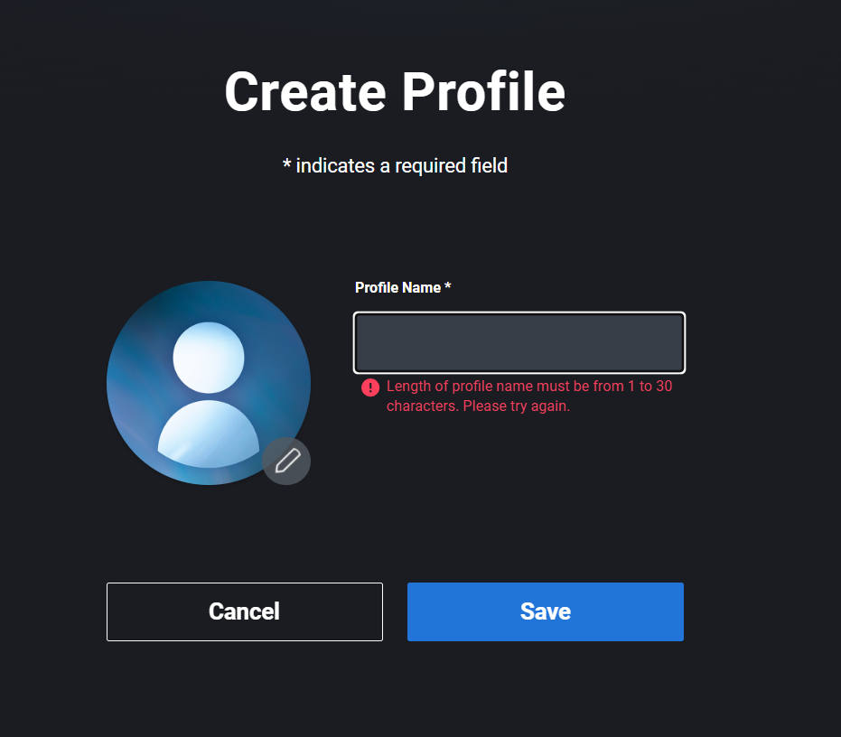
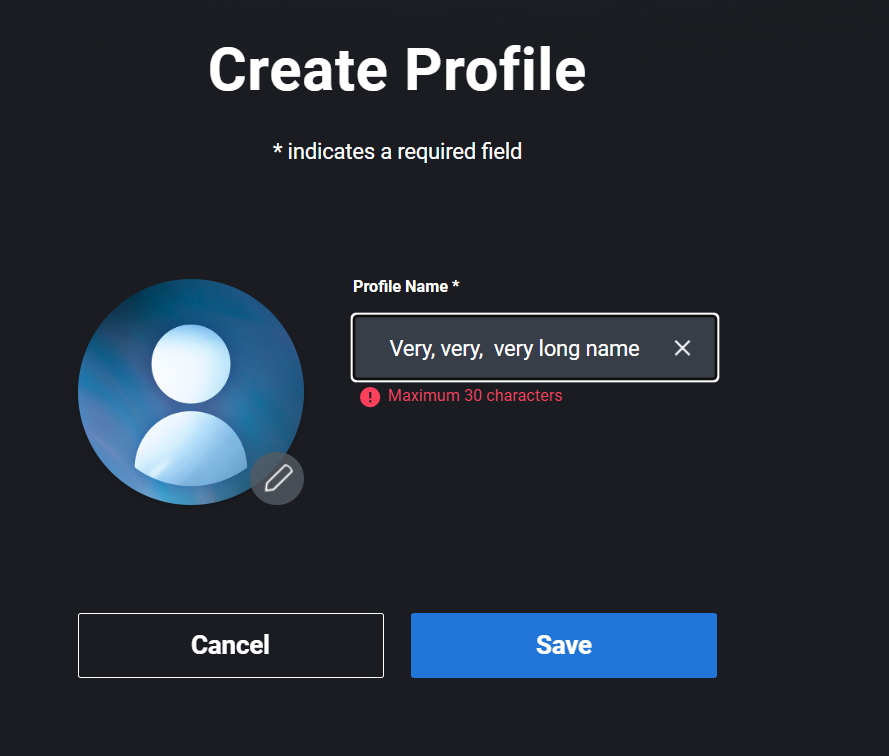
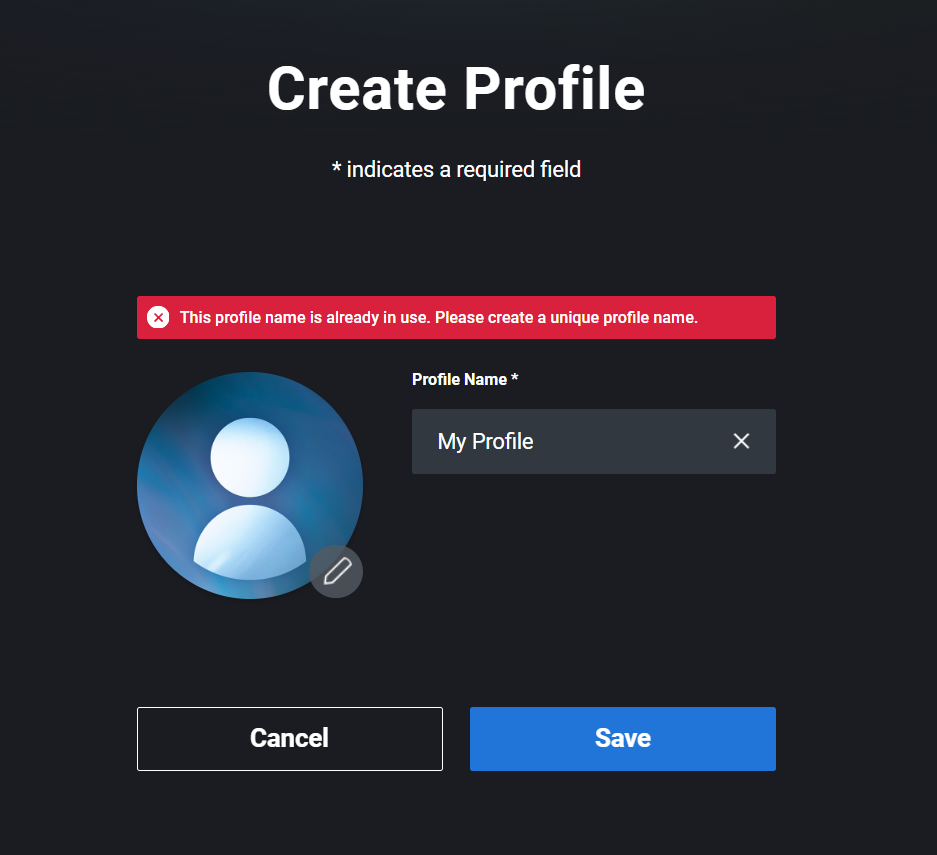
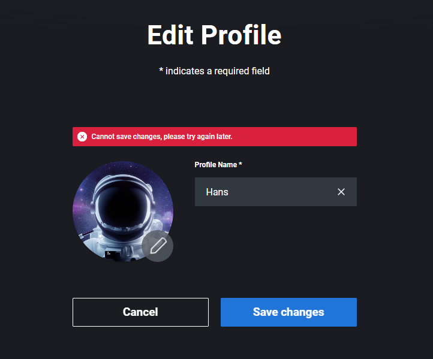
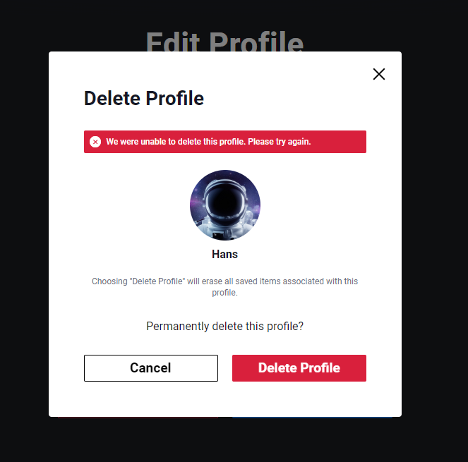
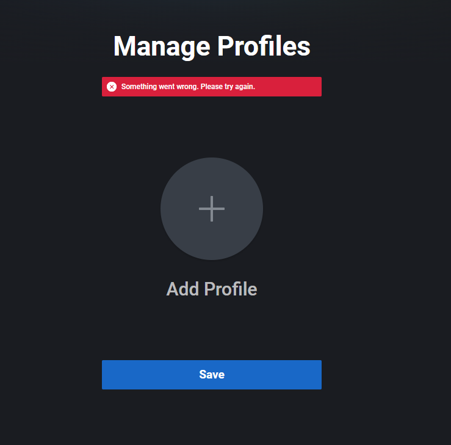
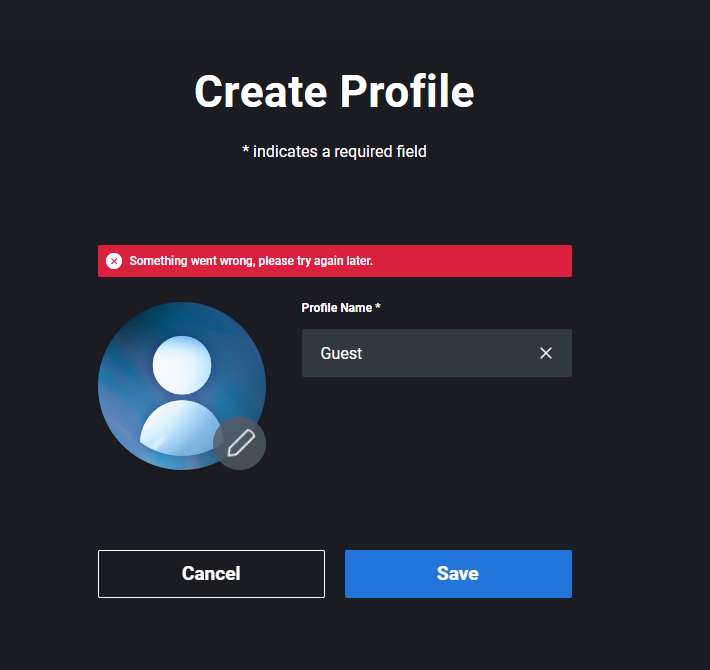
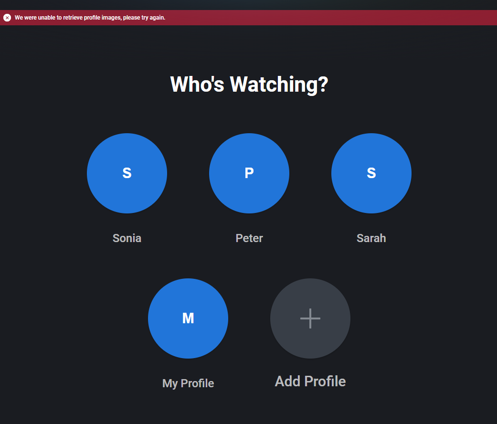

<!-- TC title -->
<header><h2>Manage Profiles - incorrect states </header>

<!-- Preconditions -->
<h3> Preconditions: </h3>
    <li>User is logged in.</li>
    <li>Uer is on a /create-profile page.</li>
    <li>User has less than the maximum number of profiles created.</li>

<h4>Assumptions:</h4>
<li> Basic and successful profile operations like create, delete, edit, as well as UI correctness, are tested in a separate, specific for them, TCs.
  

<!--Steps instruction  and their expected results -->
<!-- image format:   -->
<table>
    <tr>
        <th>No</th>
        <th>Steps</th>
        <th>Expected results</th>
    </tr><tr>
        <td>1</td>
        <td>
            <li>Click on the <i>+ Add Profile</i> CTA.</li> 
            <li>Leave the Profile Name field empty.</li>
            <li>Click on the Save CTA.</li>   
        </td><td> 
            <li>Profile is not created.</li>
            <li>There is an inline error with Profile Name requirements displayed below the field.   <i>"Length of profile name must be from 1 to 30 characters. Please try again."</i></li>
            
        </td>
    </tr><tr>
        <td>2</td>
        <td>
            <li>Type profile Name longer than 30 characters.</li>
            <li>Click on the Save CTA.</li>  
        </td>
            <td> 
            <li>Profile is not created.</li>
            <li>Inline error about length is displayed.  <i>"Maximum 30 characters"</i></li>
            
        </td>
    </tr><tr>
        <td>3</td>
        <td>
            <li>Type the profile name exactly the same as the already existing one.</li>
            <li>Click on the Save CTA.</li>
        </td><td> 
            <li>Profile is not created.</li>
            <li>There is a toast notification displayed with an error message about the Profile Name duplicate.  <i>"This profile name is already in use. Please create a unique profile name.</i></li>
            
        </td>
    </tr><tr>
        <td>4</td>
        <td>
            <li>Click the Cancel CTA.</li>
        </td><td> 
            <li>Manage Profile page is displayed.</li>
        </td>
    </tr><tr>
        <td>5</td>
        <td>
            <li>Click on existing profile to enter the <i>Edit Profile</i> page.</li>
            <li>Copy the link and open it in a separate session.</li>
        </td><td> 
            <li>Edit mode is opened for the same profile in two separate sessions.
        </td>
    </tr><tr>
        <td>6</td>
        <td>
            <li>Delete profile in one of the sessions.</li>    
        </td><td> 
            <li>Deleted profile is no longer visible on the Manage Profile screen in this session.</li>
        </td>
    </tr><tr>
        <td>7</td>
        <td>
            <li>Switch to the second, active session and edit the profile name. </li>
            <li>Click on the Save CTA.</li>
        </td><td> 
            <li>Changes are not saved.</li>
            <li>Toast message with saving error is displayed   <i>"Cannot save changes, please try again later"</i>
            
        </td>
    </tr><tr>
        <td>8</td>
        <td>
            <li>Click on the <i>Delete Profile</i> CTA.</li>
            <li>Confirm deletions on the displayed modal.</li>
        </td><td> 
            <li>Profile is not deleted.</li>
            <li>There is a toast message with an error displayed below the modal title. <i>"We were unable to delete this profile. Please try again."</i></li>
            
        </td>
    </tr><tr>
        <td>9</td>
        <td>
            <li>Simulate incorrect <i>/profile</i> endpoint state (e.g. block request).</li>
            <li>Enter the Manage Profile page.</li>
        </td><td> 
            <li>None of the existing, preciously visible profiles is displayed.</li>
            <li>Add new profile CTA is displayed.
            <li>Toast message with generic error is displayed.   <i>Something went wrong. Please try again."</i></li>
            
        </td>
    </tr><tr>
        <td>10</td>
        <td>
            <li>Click the Create Profile CTA.</li>
            <li>Insert valid profile name.</li>
            <li>Click the Save CTA.</li>    
        </td><td> 
            <li>Profile is not created.</li>
            <li>Toast message with generic error is displayed.   <i>Something went wrong. Please try again."</i></li>
            
        </td>
    </tr><tr>
        <td>11</td>
        <td>
            <li>Reverse /profile endpoint failure simulation.</li>
            <li>Simulate incorrect <i>/avatar</i> endpoint state (e.g. block request).</li>
            <li>Enter the Manage Profile page.</li>
        </td><td>
            <li>All existing profiles are displayed again.</li>
            <li>There is a toast message about the fetching avatars error displayed at the top of the page.</li>
            <li>First letters of profile names are displayed instead of avatars.
            
        </td>
    </tr>
</table>
